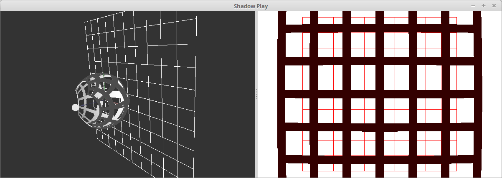

Shadow-Play
===========
A Qt Program for visualizing shadows, final project of Yale University CPSC 679 (Computational Issues in 3-D Design and Fabrication)

## Dependencies

- [CGAL ~> 4.7](http://www.cgal.org/)
- [LibQGLViewer ~> 2.6.3](http://libqglviewer.com/)
- [Qt ~> 5.5](http://www.qt.io/)
- [Assimp ~> 3.2](http://www.assimp.org/)
- [GLM ~> 0.9.7](http://glm.g-truc.net/0.9.7/index.html)

## Building from source

To build Shadow-Play, first run `cmake` then 
```
% make shadow-play
```

## Manual

Shadow-Play allows user to easily visualize shadows cast by a point light-source. The user can manipulate the 3D scene on the left-pane and see real-time shadow feedback on the right. The user can also save the current configuration to an aggragated mesh in OFF format.

The command-line arguments are a list of paths to 3D models. Shadow-Play supports all formats supported by Assimp (see a list [here](http://www.assimp.org/main_features_formats.html)).

### Basic Controls

1. Left-click and drag mouse to rotate scene
2. Right-click and drag mouse to move scene
3. Shift + Click to select a mesh or the light source.
4. Once an object is selected, all mouse controls are applied to the object's local frame.
5. Shift + Click background to de-select object.
6. When an object is selected, hold Ctrl to apply mouse controls to the entire scene.
8. Press H to see more controls and short-cuts, including taking screenshots, double-click controls etc.
9. ESC to quit

### Export

- Use Alt + S to save current configuration to `meshes.off`. It is an aggregated mesh consists of all meshes in the scene and their current coordinates. 
- The light source coordinate is output on the second line of the file as a comment.
- Meshes are re-triangulated and vertices may be duplicated.

## Screenshot


